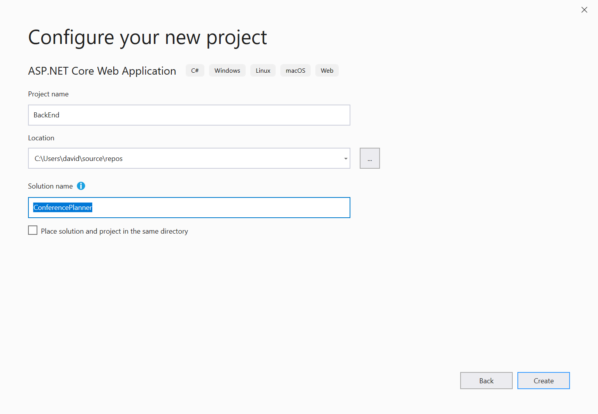
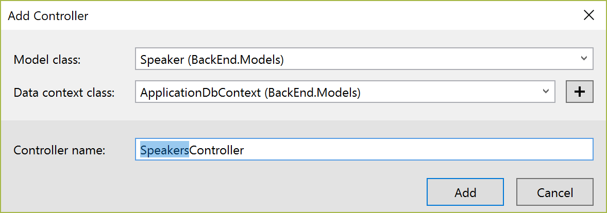
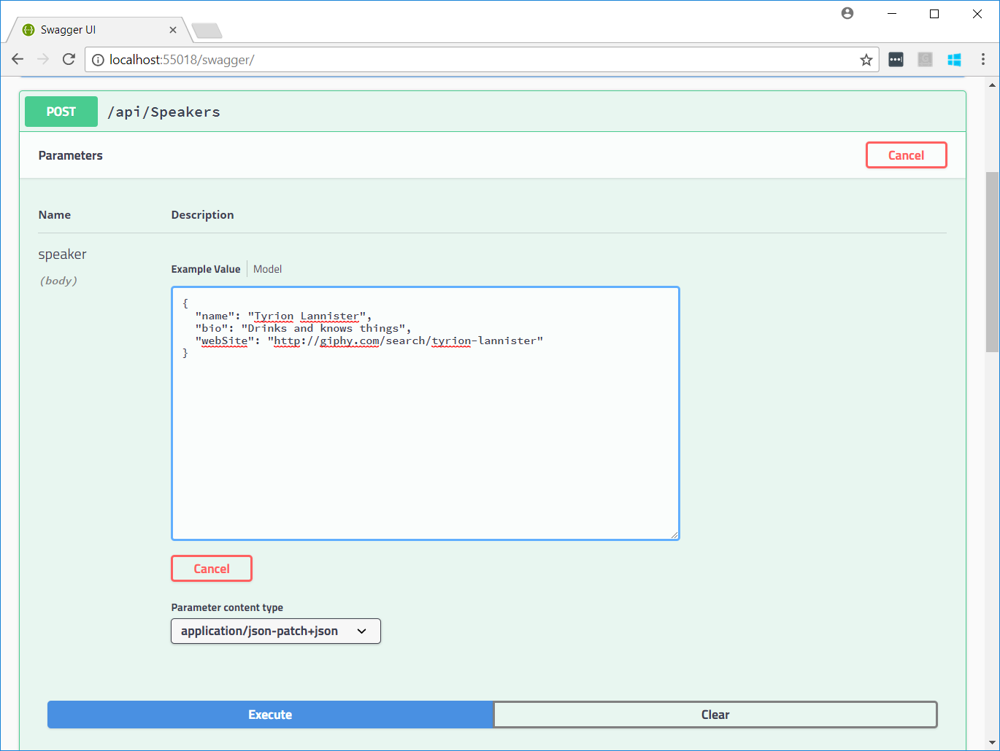
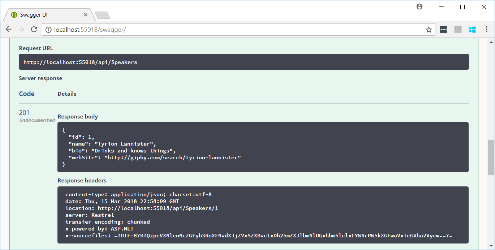

## Creating a new project using Visual Studio
1. Create and add a new project named `BackEnd` and name the solution `ConferencePlanner` using File / New / ASP.NET Core Web Application. Select the Web API template, No Auth, no Docker support.
   
   
   

   > ***Note:* If not using Visual Studio, create the project using `dotnet new webapi` at the cmd line, details as follows:**
   > 1. Create folder ConferencePlanner and call `dotnet new sln` at the cmd line to create a solution
   > 2. Create sub-folder BackEnd and create a project using `dotnet new webapi` at the cmd line inside the folder BackEnd
   > 3. Add the project to the solution using `dotnet sln add BackEnd/BackEnd.csproj`
1. Add a new `Models` folder to the root of the application.
1. Add a new `Speaker` class using the following code:
    ```csharp
    using System;
    using System.Collections.Generic;
    using System.ComponentModel.DataAnnotations;
    using System.Linq;
    using System.Threading.Tasks;

    namespace BackEnd.Models
    {
        public class Speaker
        {
           public int Id { get; set; }

           [Required]
           [StringLength(200)]
           public string Name { get; set; }

           [StringLength(4000)]
           public string Bio { get; set; }

           [StringLength(1000)]
           public virtual string WebSite { get; set; }
        }
    }
    ```
1. Add a reference to the NuGet package `Microsoft.EntityFrameworkCore.SqlServer` version `3.0.0`.
    > This can be done from the command line using `dotnet add package Microsoft.EntityFrameworkCore.SqlServer --version 3.0.0`
1. Add a reference to the NuGet package `Microsoft.EntityFrameworkCore.Sqlite` version `3.0.0`.
    > This can be done from the command line using `dotnet add package Microsoft.EntityFrameworkCore.Sqlite --version 3.0.0`
1. Next we'll create a new Entity Framework DbContext. Create a new `ApplicationDbContext` class in the `Models` folder using the following code:
    ```csharp
    using Microsoft.EntityFrameworkCore;

    namespace BackEnd.Models
    {
        public class ApplicationDbContext : DbContext
        {
            public ApplicationDbContext(DbContextOptions<ApplicationDbContext> options)
                : base(options)
            {

            }

            public DbSet<Speaker> Speakers { get; set; }
        }
    }

    ```
1. Add a connection string to the appsettings.json file for this database:

    ```json
   {
     "ConnectionStrings": {
       "DefaultConnection": "Server=(localdb)\\mssqllocaldb;Database=aspnet-BackEnd-931E56BD-86CB-4A96-BD99-2C6A6ABB0829;Trusted_Connection=True;MultipleActiveResultSets=true"
     },
     "Logging": {
       "LogLevel": {
         "Default": "Warning",
         "Microsoft": "Warning",
         "Microsoft.Hosting.Lifetime": "Information"
       }
     },
     "AllowedHosts": "*"
   }
    ```

## Register the DB Context Service
1. Add the following code to the top of the `ConfigureServices()` method in `Startup.cs`:
    ```csharp
    services.AddDbContext<ApplicationDbContext>(options =>
    {
        if (RuntimeInformation.IsOSPlatform(OSPlatform.Windows))
        {
            options.UseSqlServer(Configuration.GetConnectionString("DefaultConnection"));
        }
        else
        {
            options.UseSqlite("Data Source=conferences.db");
        }
    });
    ```
    > This code registers the `ApplicationDbContext` service so it can be injected into controllers. Additionally, it configures operating system specific database technologies and connection strings

## Configuring EF Migrations

1. Add a reference to the NuGet package `Microsoft.EntityFrameworkCore.Tools` version `3.0.0`.
    > **If you're not using Visual Studio** install the package from the command line with `dotnet add package Microsoft.EntityFrameworkCore.Tools --version 3.0.0`

### Visual Studio: Package Manager Console 

1. In Visual Studio, select the Tools -> NuGet Package Manager -> Package Manager Console

1. Run the following commands in the Package Manager Console
   ```console
   Add-Migration Initial
   Update-Database
   ```

### Command line

1. Install the EntityFramework global tool `dotnet-ef` using the following command:
   ```console
   dotnet tool install -g dotnet-ef --version 3.0.0
   ```

1. Open a command prompt and navigate to the project directory. (The directory containing the `Startup.cs` file).

1. Run the following commands in the command prompt:
    ```console
    dotnet build
    dotnet ef migrations add Initial
    dotnet ef database update
    ```
Commands Explained

| Command       |Description       |
| ------------- |-------------|
| `dotnet ef migrations add Initial` / `Add-Migration Initial`    | generates code to create the initial database schema based on the model specified in 'ApplicationDbContext.cs'. `Initial` is the name of the migration. |  
|`dotnet ef database update` / `Update-Database` | creates the database      |

  >For more information on these commands and scaffolding in general, see [this tutorial](https://docs.microsoft.com/en-us/aspnet/core/tutorials/first-mvc-app/adding-model#add-initial-migration-and-update-the-database).

  >If your database ever gets in a bad state and you'd like to reset things, you can use `dotnet ef database drop` followed by `dotnet ef database update` to remove your database and run all migrations again.

## A quick look at the Weather Forecast Controller
First, open the `Controllers` folder and take a quick look at the `WeatherForecastController`. You'll see a simple function that corresponds to the HTTP GET verb. You'll see the output of this controller in a bit, but first we'll build our own API controller for the `Speakers` model class.

## Scaffolding an API Controller
### Using Visual Studio
1. Right-click the `Controllers` folder and select Add/Controller. Select "API Controller with actions, using Entity Framework".
1. In the dialog, select the `Speaker` model for the Model Class, `ApplicationDbContext` for the "Data Context Class" and click the `Add` button.
   

### Using the cmd line
1. Install the "Microsoft.VisualStudio.Web.CodeGeneration.Design" package
    ```console
    dotnet add package Microsoft.VisualStudio.Web.CodeGeneration.Design --version 3.0.0
    ```

1. Install the `aspnet-codegenerator` global tool by running the following command:
    ```console
    dotnet tool install -g dotnet-aspnet-codegenerator --version 3.0.0
    ```

> Note: You will need to close and reopen the console window to be able to use this tool.
2. Run the following in the project folder at the cmd line:
    ```console
    dotnet aspnet-codegenerator controller -api -name SpeakersController -m Speaker -dc BackEnd.Models.ApplicationDbContext -outDir Controllers
    ```

## Testing the API using the Swashbuckle

In this section, we'll be adding documentation to our API using the Swashbuckle NuGet package.

[Swashbuckle.AspNetCore](https://github.com/domaindrivendev/swashbuckle.aspnetcore) is an open source project for generating Swagger documents for Web APIs that are built with ASP.NET Core.

[Swagger](https://swagger.io) is a machine readable representation of a RESTful API that enables support for interactive documentation, client SDK generation and discoverability.

Additional information on using Swashbuckle in ASP.NET Core is available in this tutorial: [ASP.NET Web API Help Pages using Swagger](https://docs.microsoft.com/en-us/aspnet/core/tutorials/web-api-help-pages-using-swagger)

1. Add a reference to the NuGet package `Swashbuckle.AspNetCore` version `5.0.0-rc4`.
    > This can be done from the command line using `dotnet add package Swashbuckle.AspNetCore --version 5.0.0-rc4`

1. Add the Swashbuckle services in your `ConfigureServices` method:
    ```csharp
    services.AddControllers();

    services.AddSwaggerGen(options =>
        options.SwaggerDoc("v1", new OpenApiInfo { Title = "Conference Planner API", Version = "v1" })
    );
    ```
1. Configure Swashbuckle by adding the following lines just before `UseRouting` in the `Configure` method in `Startup.cs`:
    ```csharp
    app.UseSwagger();

    app.UseSwaggerUI(options =>
        options.SwaggerEndpoint("/swagger/v1/swagger.json", "Conference Planner API v1")
    );
    ```
    > ***Note:* Due to how the middleware and pipeline are structured, you'll want to place this before the `app.UseEndpoints()` statement.**
1. Add a redirect to the end of the pipeline that redirects to the swagger end point. 
   ```csharp
   app.Run(context =>
   {
       context.Response.Redirect("/swagger");
       return Task.CompletedTask;
   });
   ```

1. Run the application (F5 in Visual Studio or `dotnet run` from console).
1. Browse to the Swagger UI at `http://localhost:<random_port>/swagger`.
    
1. First, click on the *GET* button in *WeatherForecast* section. You'll see the values that were listed in the `WeatherForecastController` earlier.
1. In the *Speakers* section, click on the *GET* button. You'll see there are not speakers returned. Let's add one!
1. In the *Speakers* section, click on the *POST* button. Referencing the example on the right, fill in a speaker request. Leave the `ID` blank, that will be filled in by the database.
    
    ```json
    {
      "name": "Tyrion Lannister",
      "bio": "Drinks and knows things",
      "webSite": "http://giphy.com/search/tyrion-lannister"
    }
    ```
1. When you click the *Try it out!* button, you should see a success response from the server. Now, clicking the *GET* button above should show your newly added speaker.
    

**Next**: [Session #2 - Back-end](2.%20Build%20out%20BackEnd%20and%20Refactor.md)
