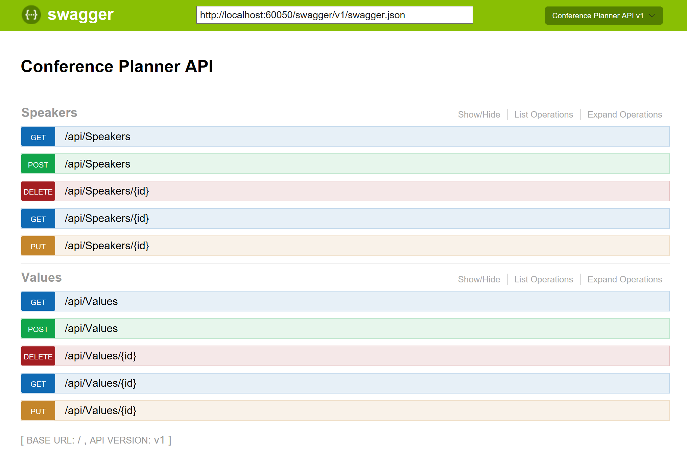

## Creating a basic EF model

1. Create a new project using File / New / ASP.NET Core Web Application. Select the Web API template, No Auth, no Docker support.
> Note: If not using Visual Studio, create the project using `dotnet new webapi`
1. Add a new `Models` folder to the root of the application.
1. Add a new `Speaker` class using the following code:
    ```csharp
    using System;
    using   System.Collections.Generic;
    using System.Linq;
    using   System.Threading.Tasks;
  
    namespace BackEnd.Models
    {
        public class Speaker
        {
           public int ID { get; set; }
    
           [Required]
           [StringLength(200)]
           public string Name { get; set; }
    
           [StringLength(4000)]
           public string Bio { get; set; }
    
           [StringLength(1000)]
           public virtual string WebSite { get; set; }
        }
    }
    ``` 
1. Next we'll create a new Entity Framework DbContext. Create a new `ApplicationDbContext` class in the `Models` folder using the following code:
    ```csharp
   using Microsoft.EntityFrameworkCore;
   using Microsoft.EntityFrameworkCore.   Infrastructure;
   using Microsoft.Extensions.DependencyInje   ction;
   using System;
   using System.Collections.Generic;
   using System.Linq;
   using System.Threading.Tasks;
   
   namespace BackEnd.Models
   {
       public class    ApplicationDbContext :    DbContext
       {
           public ApplicationDbContext   (DbContextOptions<Applicati   onDbContext> options)
               : base(options)
           {
   
           }
   
           public DbSet<Speaker>    Speaker { get; set; }
       }
   
       public class    ApplicationDbContextFactory :    IDbContextFactory<ApplicationDb   Context>
       {
           public    ApplicationDbContext Create   (string[] args) =>
               Program.BuildWebHost   (args)   .Services.CreateScope()   .ServiceProvider.   GetRequiredService<Appl   icationDbContext>();
       }
   }
    ```
1. Add a connection string to the appSettings.json file for this database:

   ```json
   {
     "Logging": {
       "IncludeScopes": false,
       "LogLevel": {
         "Default": "Warning"
       }
     },
     "ConnectionStrings": {
       "DefaultConnection": "Server=(localdb)\\mssqllocaldb;   Database=BackEndContext-2faf96a   f-a5fb-451a-b07e-fdd7036f2002;   Trusted_Connection=True;   MultipleActiveResultSets=true"
     }
   }
   ```

## Scaffolding an API Controller 
1. Right-click the `Controllers` folder and select Add/Controller. You'll be shown a prompt for setting up Scaffolding. Select "Minimal Dependencies".
1. Again, right-click the `Controllers` folder and select Add/Controller. Select "API Controller with Actions, Using EF".
1. In the dialog, select the `Speaker` model for the Model Class, `ApplicationDbContext` for the "Data Context Class" and click the `Add` button.

## Testing the API using the Swashbuckle

In this section, we'll be adding documentation to our API using the Swashbuckle NuGet package.

Swashbuckle.AspNetCore is an open source project for generating Swagger documents for Web APIs that are built with ASP.NET Core MVC.

Swagger is a machine readable representation of a RESTful API that enables support for interactive documentation, client SDK generation and discoverability.

Additional information on using Swashbuckle in ASP.NET Core is available in this tutorial: [ASP.NET Web API Help Pages using Swagger](https://docs.microsoft.com/en-us/aspnet/core/tutorials/web-api-help-pages-using-swagger)

1. Add the `Swashbuckle.AspNetCore` NuGet package.
   > This can be done from the command line using `dotnet add package Swashbuckle.AspNetCore`
1. Configure Swashbuckle by adding the following lines to the `Configure()` method in `Startup.cs`:
   ```csharp
    app.UseSwagger();

    app.UseSwaggerUI(options =>
        options.SwaggerEndpoint("/swagger/v1/swagger.json", "Conference Planner API v1")
    );
   ```
1. Run the application (F5 in Visual Studio or `dotnet run` from console). 
1. Browse to the Swagger UI at `http://localhost:<random_port>/swagger`. 
   
