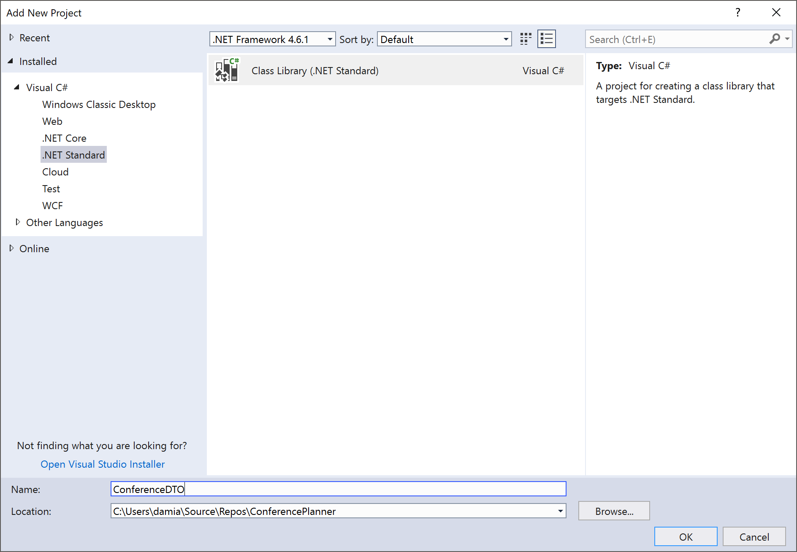

## Building out the Back End

In this session, we'll add the rest of our models and controllers that expose them. We'll also refactor our application, moving our DTOs to a shared project so they can be used by our front-end application later.

## Add a ConferenceDTO project
> We'll start by creating the new shared project to hold our data transfer objects.
### Adding the ConferenceDTO Project using Visual Studio
1. If using Visual Studio, right-click on the Solution and select *Add* / *New Project...*.
1. Select *.NET Standard* from the project types on the left and select the *Class Libarary (.NET Standard)* template. Name the project ConferenceDTO and press OK.

1. Delete the generated `Class1.cs` file from this new project.

### Adding the ConferenceDTO project via the Command Line
1. Open a command prompt and navigate to the root `ConferencePlanner` directory.
1. Run the following command: 
   ```
   dotnet new classlib -o ConferenceDTO -f netstandard2.0
   ```
1. Next we'll need to add a reference to the ConferenceDTO project from the BackEnd project. From the command line, navigate to the BackEnd project directory and execute the following command:
   ```
   dotnet add reference ../ConferenceDTO/ConferenceDTO.csproj
   ```

## Refactoring the Speaker model into the ConferenceDTO project
1. Copy the `Speaker.cs` class from the *BackEnd* application into the root of the new ConferenceDTO project, and change the namespace to `ConferenceDTO`.
1. The data annotations references can't be resolved to a missing NuGet package. Add a reference to `System.ComponentModel.Annotations`. When the package restore completes, you should see that your data annotations are now resolved.
1. Go back to the *BackEnd* application and modify the code in `Speaker.cs` as shown:
   ```csharp
   public class Speaker : ConferenceDTO.Speaker
   {
   }
   ```
1. Run the application and view the Speakers data using the Swagger UI to verify everything still works.